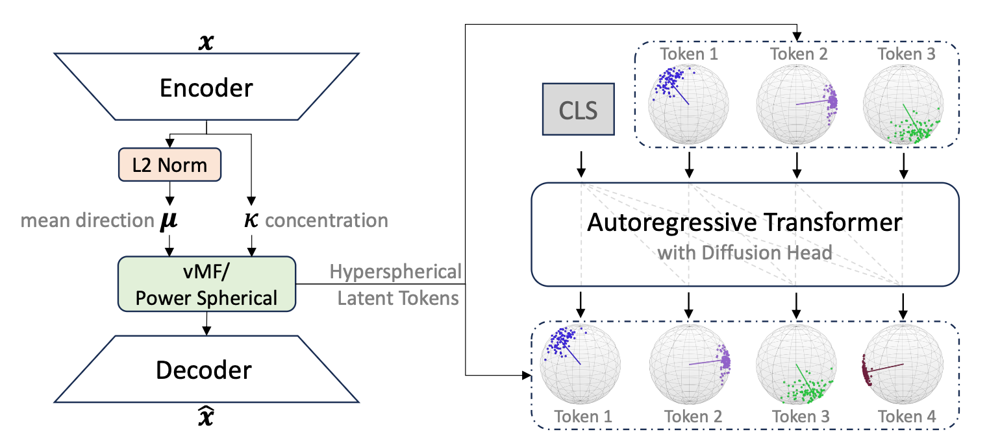
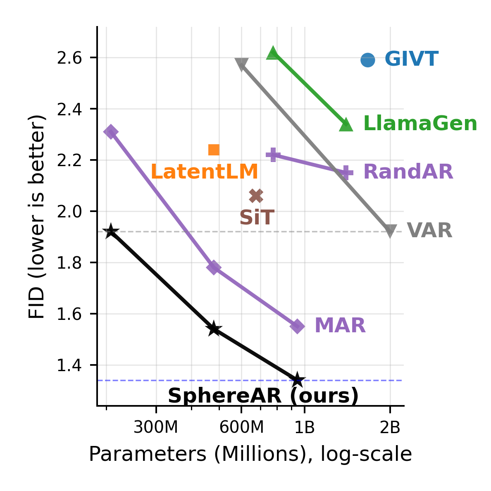

# SphereAR: Hyperspherical Latents Improve Continuous-Token Autoregressive Generation

[](https://arxiv.org/abs/2509.24335)&nbsp;
[](https://huggingface.co/guolinke/SphereAR)&nbsp;


<p align="center">

<p>

This is the official PyTorch implementation of paper [Hyperspherical Latents Improve Continuous-Token Autoregressive Generation](https://arxiv.org/abs/2509.24335).

```
@article{ke2025hyperspherical,
   title={Hyperspherical Latents Improve Continuous-Token Autoregressive Generation}, 
   author={Guolin Ke and Hui Xue},
   journal={arXiv preprint arXiv:2509.24335},
   year={2025}
}
```


## Introduction

<p align="center"></p>

SphereAR is a simple yet effective approach to continuous-token autoregressive (AR) image generation: it makes AR scale-invariant by constraining all AR inputs and outputs---**including after CFG**---to lie on a fixed-radius hypersphere (constant L2 norm) via hyperspherical VAEs. 

The model is a **pure next-token** AR generator with **raster** order, matching standard language AR modeling (i.e., it is *not* next-scale AR like VAR and *not* next-set AR like MAR/MaskGIT). 

On ImageNet 256×256, SphereAR achieves a state-of-the-art FID of **1.34** among AR image generators.


## Environment

- PyTorch: 2.7.1 (CUDA 12.6 build)
- FlashAttention: 2.8.1

### Install notes
1.	Install PyTorch 2.7.1 (CUDA 12.6) using your preferred method.
2.	Install FlashAttention 2.8.1 from the prebuilt wheel (replace the cp310 tag with your Python version, e.g., cp311 for Python 3.11):
```shell
pip install https://github.com/Dao-AILab/flash-attention/releases/download/v2.8.1/flash_attn-2.8.1+cu12torch2.7cxx11abiTRUE-cp310-cp310-linux_x86_64.whl
```


## Class-conditional image generation on ImageNet

### Model Checkpoints 

Name | params | FID (256x256) | weight 
--- |:---:|:---:|:---:|
S-VAE | 75M | - | [vae.pt](https://huggingface.co/guolinke/SphereAR/blob/main/vae.pt)
SphereAR-B   | 208M | 1.92 | [SphereAR_B.pt](https://huggingface.co/guolinke/SphereAR/blob/main/SphereAR_B.pt)
SphereAR-L   | 479M | 1.54 | [SphereAR_L.pt](https://huggingface.co/guolinke/SphereAR/blob/main/SphereAR_L.pt)
SphereAR-H   | 943M | 1.34 | [SphereAR_H.pt](https://huggingface.co/guolinke/SphereAR/blob/main/SphereAR_H.pt)

### Evaluation from checkpoints

1. Sample 50,000 images and save to `.npz`.

SphereAR-B:
```shell
ckpt=your_ckpt_path
result_path=your_result_path
torchrun --nnodes=1 --nproc_per_node=8 --node_rank=0 \
sample_ddp.py --model SphereAR-B --ckpt $ckpt --cfg-scale 4.5 \
--sample-dir $result_path   --per-proc-batch-size 256 --to-npz
```

SphereAR-L:
```shell
ckpt=your_ckpt_path
result_path=your_result_path
torchrun --nnodes=1 --nproc_per_node=8 --node_rank=0 \
sample_ddp.py --model SphereAR-L --ckpt $ckpt --cfg-scale 4.6 \
--sample-dir $result_path   --per-proc-batch-size 256 --to-npz
```

SphereAR-H:
```shell
ckpt=your_ckpt_path
result_path=your_result_path
torchrun --nnodes=1 --nproc_per_node=8 --node_rank=0 \
sample_ddp.py --model SphereAR-H --ckpt $ckpt --cfg-scale 4.5 \
--sample-dir $result_path   --per-proc-batch-size 256 --to-npz
```

2. Compute metrics following [OpenAI’s evaluation protocol](https://github.com/openai/guided-diffusion/tree/main/evaluations). You should download the [reference batch](https://openaipublic.blob.core.windows.net/diffusion/jul-2021/ref_batches/imagenet/256/VIRTUAL_imagenet256_labeled.npz), and run `python evaluator.py VIRTUAL_imagenet256_labeled.npz your_generated.npz` for the metric. TensorFlow is required, and we use ```tensorflow==2.19.1```.


### Reproduce our training:

1. Download [ImageNet](http://image-net.org/download) dataset. **Note**: Our code support to train from the tar file, the decompression is not needed.

2. Train the S-VAE:

```shell
data_path=your_data_path/ILSVRC2012_img_train.tar
result_path=your_resulet_path
torchrun --nnodes=1 --nproc_per_node=8 --node_rank=0 \
train.py --results-dir $result_path --data-path $data_path \
--image-size 256 --epochs 100 --patch-size 16 --latent-dim 16  --vae-only \
--lr 1e-4 --global-batch-size 256 --warmup-steps -1 --decay-start -1
```

3. Train the AR model:

```shell
data_path=your_data_path/ILSVRC2012_img_train.tar
result_path=your_resulet_path
vae_ckpt=your_vae_path
torchrun --nproc_per_node=8 --master_addr=$WORKER_0_HOST --node_rank=$LOCAL_RANK --master_port=$WORKER_0_PORT --nnodes=$WORKER_NUM \
train.py --results-dir $result_path --data-path $data_path --image-size 256 \
--model SphereAR-B --epochs 400 --patch-size 16 --latent-dim 16 \
--lr 3e-4 --global-batch-size 512 --trained-vae $vae_ckpt --ema 0.9999
```
You can use the script above to train `SphereAR-B`; to train other sizes, set `--model` to `SphereAR-L` or `SphereAR-H`.
We trained on A100 GPUs with the following setups: 8×A100 for SphereAR-B, 16×A100 for SphereAR-L, and 32×A100 for SphereAR-H.
The training costs about 3 days for 400 epochs.

**Note**: We use `torch.compile` for acceleration. Occasionally the TorchInductor compile step can hang; if that happens, re-run the job. Enabling Dynamo logs tends to reduce stalls: `export TORCH_LOGS="+dynamo"`.  To avoid repeated compilation cost across runs, enable the compile caches:

```shell
export TORCHINDUCTOR_FX_GRAPH_CACHE=1
export TORCHINDUCTOR_AUTOGRAD_CACHE=1
```

Set these environment variables in your shell (or job script) before launching training.

